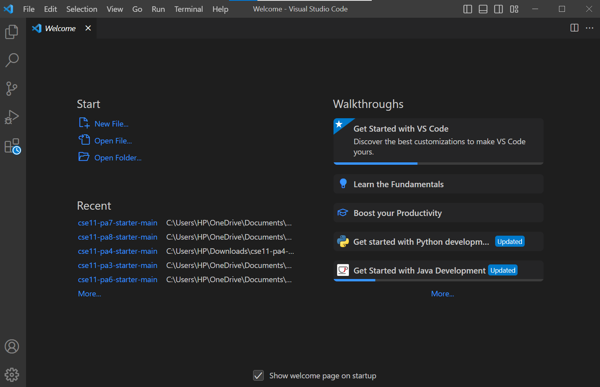
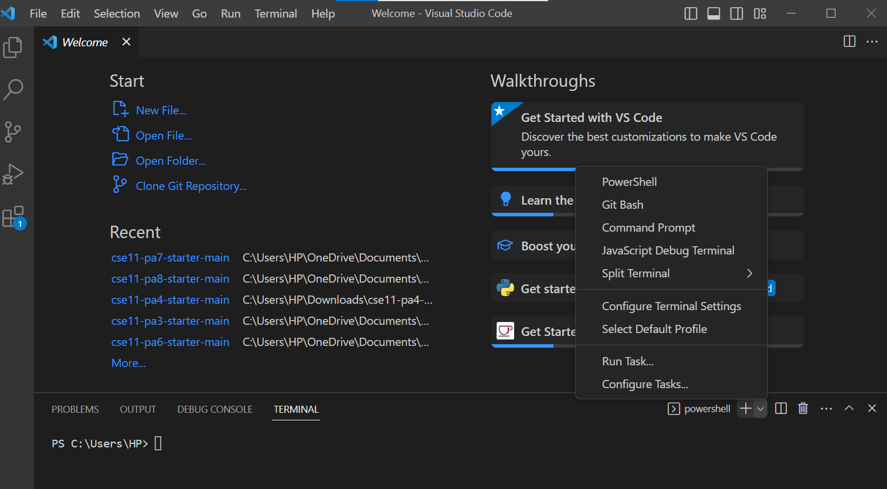
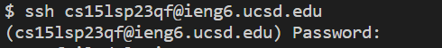
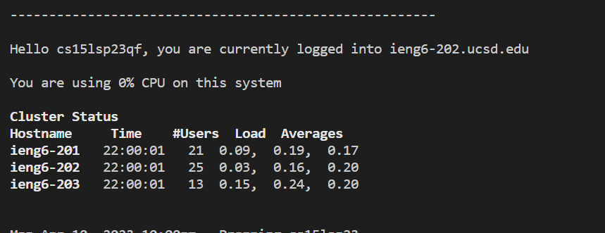
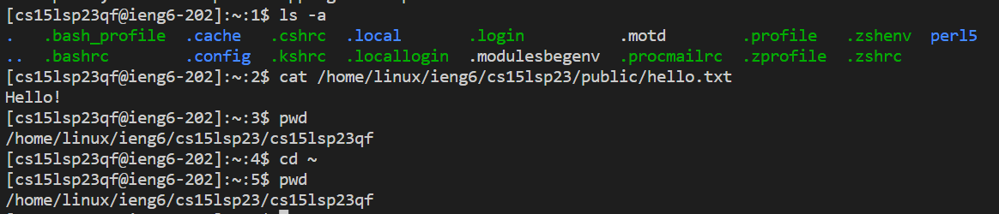

# **Lab Report 1**
## How To Get Remote Access
---
> **Download VScode and Git If You Need It**
- VScode must be dowloaded. I already had VScode downloaded prior to the lab so I could skip this step but if I need to in the future I can download it from [this link](https://code.visualstudio.com/)

- Git for Windows must be downloaded if you use a windows computer which you get with [this link](https://gitforwindows.org/)

> **Remotely Connecting**
- Open a terminal in VScode
- Go to the lower righthand corner and click the "v" symple next to the "+" symbol which should give you a list of options to select, and you need to select Git Bash

- Now in the terminal type `ssh courseAccountName@ieng6.ucsd.edu` and enter, with "courseAccountName" replaced by your actual course account name                       

- If prompted with a message of if you want to continue type `yes` and enter, this can happen if you are on a new server for the first time, then type your password and enter

- Now you are connected!

> **Trying Out Some Commands**
- `ls -a` This command list the folders and files given by the path
- `cd ~` This command changes the directory to the home directory, it doesn't output anything to the terminal (shown in the photo)
- `pwd` This command prints the working directory (the photo shows the working directory printed out before and after the command `cd ~`
 are the same because we were already working in the home directory)
- `cat /home/linux/ieng6/cs15lsp23/public/hello.txt` This command prints the contents of the file hello.txt given by the path

