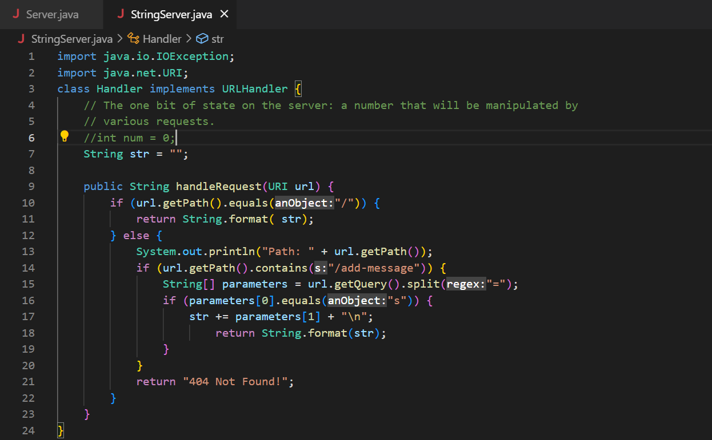
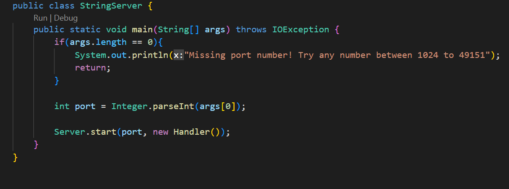
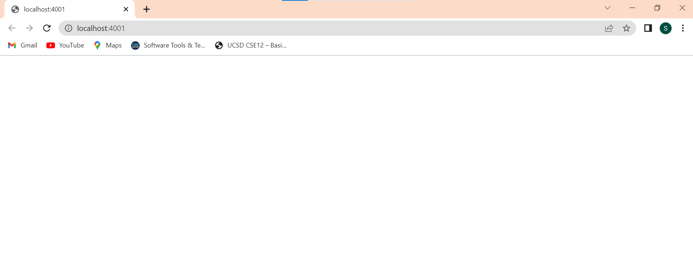
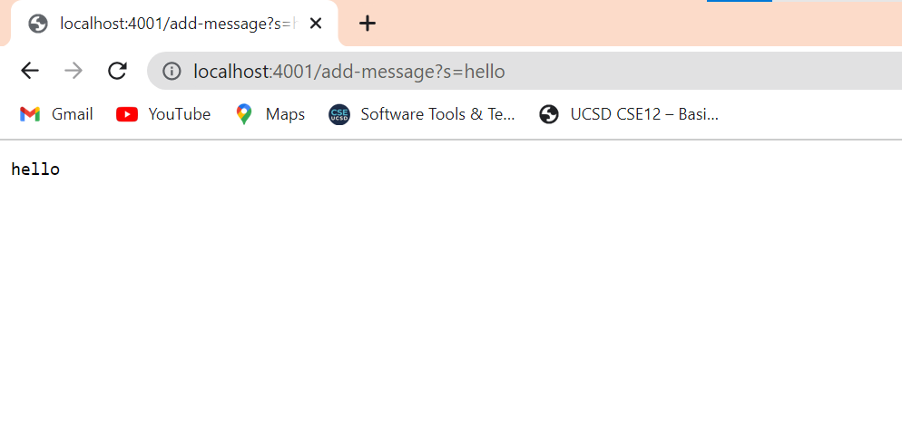
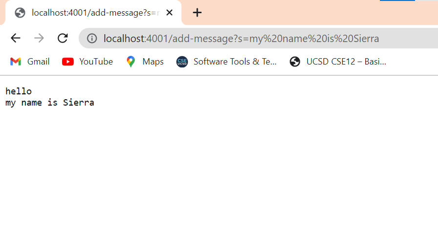
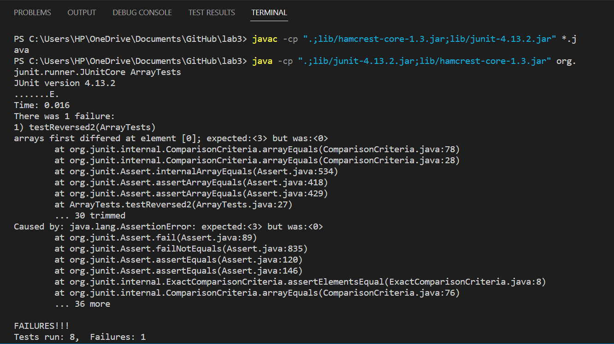

# **Lab Report 2**
## Servers and Bugs
---
> **Part 1**
- I modified code from Lab 2 for this assignment. I used the `Server.java` file and modified the `NumberServer.java` file.





- For the very first screenshot, before any messages are added, the method ==start()== in the ==Server== class is called. While this is called, a ==new Handler()== is created which calls the ==handleRequest()== method that takes the ==URI== of the newly opened server. However since the value of the ==URI== doesn't have any paths the ==String== ==str== that stores the value of the message on the web page remains empty so nothing is displayed. For the second screenshot which is after adding the path ==/add-message?s=hello== to the ==URI==, the ==handleRequest()== method is called for a new ==URI== as the parameter. Then in this method the local variable ==str== is updated to include the new message from the path taken in the ==URI== and a new line. 

> **Part 2**
- Code with a bug:
```
static int[] reversed(int[] arr) {
    int[] newArray = new int[arr.length];
    for(int i = 0; i < arr.length; i += 1) {
      arr[i] = newArray[arr.length - i - 1];
    }
    return arr;
  }
  ```
- Failure inducing input as a test: 
```
  @Test
  public void testReversed2() {
    int[] input1 = {0,1,2,3 };
    assertArrayEquals(new int[]{ 3,2,1,0}, ArrayExamples.reversed(input1));
  }
  ```
- Non Failure inducing input as a test:
 ```
 @Test
  public void testReversed3() {
    int[] input1 = {};
    assertArrayEquals(new int[]{}, ArrayExamples.reversed(input1));
  }
  ```
  
 - The above photo is the result of running the two tests along with other tests created in lab. 
 - Fixed code without a bug
 ```
 static int[] reversed(int[] arr) {
    int[] newArray = new int[arr.length];
    for(int i = 0; i < arr.length; i += 1) {
      newArray[i] = arr[arr.length - i - 1];
    }
    return newArray;
  }
  ```
 - This fix adresses the issues because the issue is that the new array that was created wasn't being modified, instead the array that was taken as a parameter was being modified. Simlarly, the new array wasn't being returned and instead the array that was taken as a parameter was returend. By changing the code inside the for loop to the new array being modifed, `newArray[i] = arr[arr.length - i - 1];`, and the new array being returned, `return newArray;`, this bug was fixed. 

> **Part 3**
- One thing I learned was the difference between a symptom, a bug, and failure inducing input. Previously when I tried to debug I didn't have these terms defined. I knew bugs were things that caused problems in code but I never really thought of the concepts of symptoms or failure inducing input. Now I know symptoms are behavior that result from bugs and failure inducing inputs expose a bug's symptoms.

