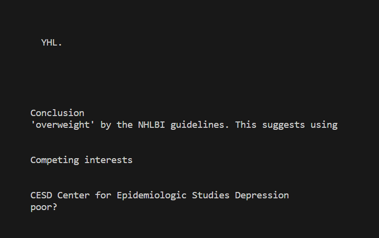
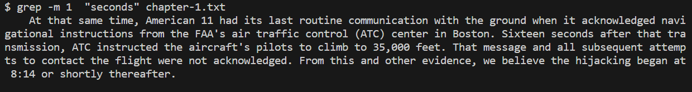

# **Lab Report 3**
## Researching Commands: grep
---
> **Command: grep**
- `grep -v`finds the inverse match, or the lines that don't contain the string that is passed to it, which is uselful for filtering a file if you don't want to find some instances. I found this from [this link](https://en.wikibooks.org/wiki/Grep).
- Examples: 

- `grep -o` prints only the string/s found in the file that match the string passed to it, which is useful to visually see the amount of occurences a particular string has in a file. I found this from [this link](https://en.wikibooks.org/wiki/Grep).

- `grep -i` finds and outputs matching lines that contain the string passed to it no matter the upper of lower case, which is helpful if you want to find all instances of a string in a file. I found this from [this link](https://en.wikibooks.org/wiki/Grep).

- `grep -m <num>` finds and ouputs matching lines that contain the string passed to it, but the amount of lines it finds is only up to the number passed to it, which is helpful if you don't want to look at such a large output if there are many instances of matches. I found this from [this link](https://en.wikibooks.org/wiki/Grep).

