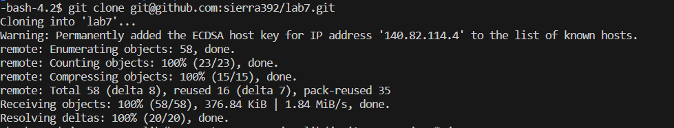
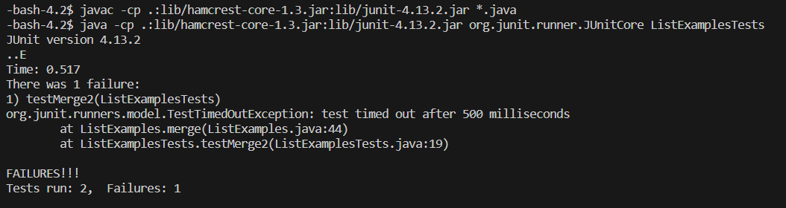
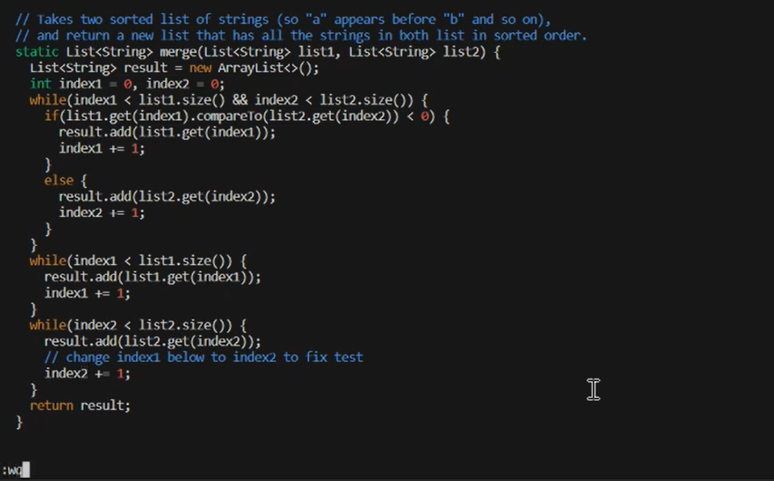
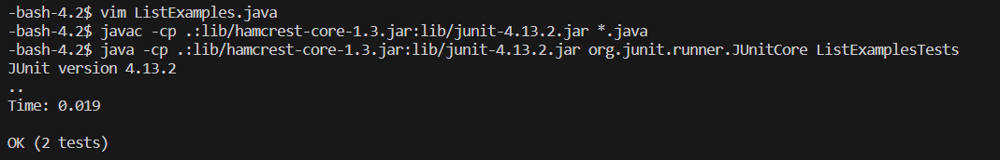
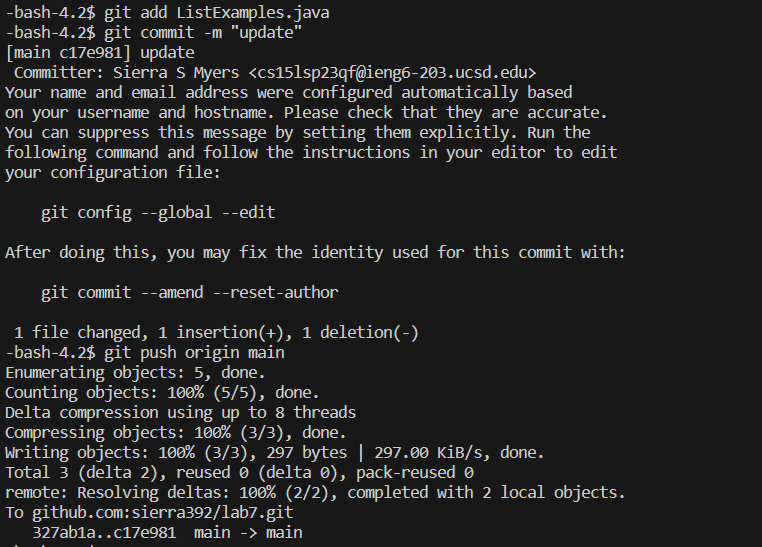

# **Lab Report 4**
---
> **Step 4 (Log in)**
- Commands: `ssh cs15lsp23qf@ieng6.ucsd.edu`, `<enter>`
-  This allowed me to long into my course account. 
- 
> **Step 5 (Clone)**
- Commands: `git clone git@github.com:sierra392/lab7.git`, `<enter>`
- This allowed me to clone the fork I made of the lab7 repository. An important step was to copy the ssh key from my fork. 
- 
> **Step 6 (Run tests with failure)**
- Commands: `cd lab7`, `<enter>`, `javac -cp .:lib/hamcrest-core-1.3.jar:lib/junit-4.13.2.jar *.java`, `<enter>`, `java -cp .:lib/hamcrest-core-1.3.jar:lib/junit-4.13.2.jar org.junit.runner.JUnitCore ListExamplesTests`, `<enter>`
- First I needed to change directories to the lab7 repository. Then I ran two appropriate commands to compile and run the JUnit tests. This resulted in 1 of the tests failing. 
- 
> **Step 7 (Edit code to fix failing test)**
- Commands: `vim ListExamples.java`
- Commands inside vim: `<j>` 44 times, `<l>` 12 times,  `<x>`, `<i>`, `<enter>`, `<2>`, `<esc>`, `:wq`, `<enter>`
- First I entered the vim editor. Then I positioned my cursor over the appriopiate spot in the file, using `<j>` and `<l>`. Then I deleted the incorrect character and entered the correct charater using delete and insert mode in vim. Finally I saved my changes with the command `:wq`. I only screenshotted a portion of ListExamples.java because it didn't all fit on my screen.
- 
> **Step 8 (Run tests again with sucess)**
- Commands: `<^>` 3 times (`javac -cp .:lib/hamcrest-core-1.3.jar:lib/junit-4.13.2.jar *.java` was 3 up in my search history), `<enter>`, `<^>` 3 times ( `java -cp .:lib/hamcrest-core-1.3.jar:lib/junit-4.13.2.jar org.junit.runner.JUnitCore ListExamplesTests` was 3 up in my search history), `<enter>`, 
- By using the up arrows, I accessed the memory to run the previous commands to compile and run the JUnit tests. This resulted in both tests passing. 
- 
> **Step 9 (Commit and Push to Github)**
- Commands: `git add ListExamples.java`, `<enter>`, `git commit -m "update"`, `<enter>`, `git push origin main`, `<enter>`
- Using these git commands I was able to add the file ListExamples.java to the set of changes to be commited, then I commited my changes with the message "update", then I pushed my changes to my repository on github. 
- 
