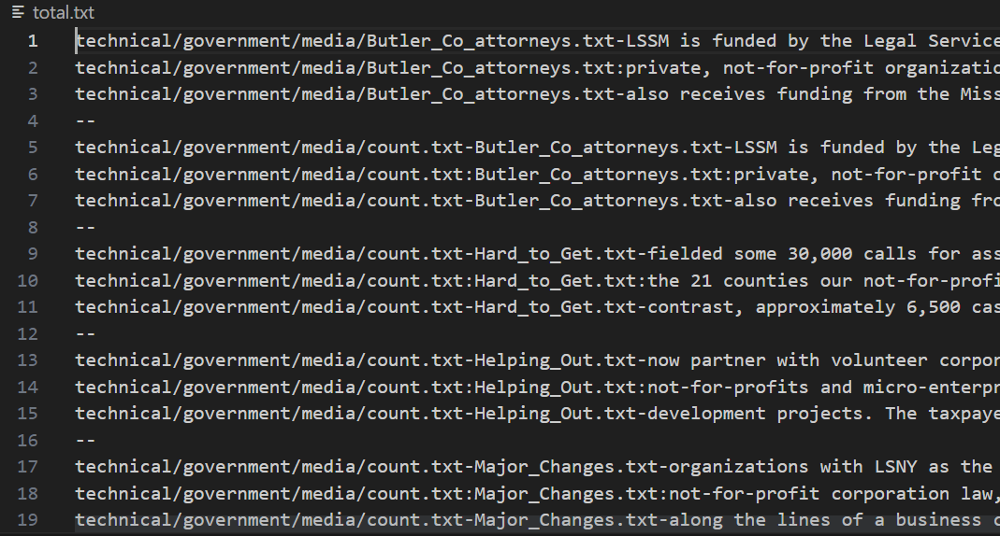

# **Lab Report 5**
---
>**Post From Student**

> **TA Response**
- "Have you tried looking at the output in `total.txt` to see if it is what you expected from the `grep` command? It seems like the wrong output may be directed to `total.txt` from the `grep` command. You should try looking at the contents from `total.txt` to see if it is what you would expect from `grep -l` and if it is not what you expect, look at how you wrote your command again to see if you made a typo or error."
> **Output after TA Response**

- Now the command is producing the right output expected. The bug was instead of doing `grep -l`, the student was doing `grep -1`, or using a one (1) instead of the letter l. Something similar happened to me in a lab and I had to ask my lab partners and the TA until the error was discovered. 
> **Setup Information**
- The file and directory structure needed for this is the repository from lab 4, which is docsearch. Additionally this scenario requires a bash script file, which I named `report5.sh`, which needs to make an error by using `grep -1` instead of `grep -l`, which is described  and shown above.
- The contents of the original docsearch repository are never changed. The contexts from the bash script before fixing include the line with the error `grep -1 "not-for-profit" technical/government/media/*.txt > total.txt` as well as more lines that use `wc -l` to count the lines in `total.txt` and use this output in the final `echo` statement
- 
- 
- The first photo shows `total.txt` with the wrong output from the `grep` command, and the second photo shows what it would look like correct. The image in the Edstem post shows the bash script containing the error
- The command I ran in the terminal to trigger the bug was the command to run the bash script, or `bash report5.sh`, however the line in the bash script that triggered the error was `grep -1 "not-for-profit" technical/government/media/*.txt > total.txt`
- The edit to fix the bug was changing the previosly mentioned `grep` command from `grep -1` to `grep -l`
---
> **Reflection**
- One thing I found out from lab that I thought was cool was understanding how gradescope worked and creating my own bash scripts to run tests on code. It was interesting to see how something I've been using all of my freshman year worked. I never previously thought about it, I just submitted my code to gradescope and waiting to see if I passed my tests, so now its cool to understand it at a different level. Additionally I thought it was interesting to see how to write in a different syntax for bash scripts. 
